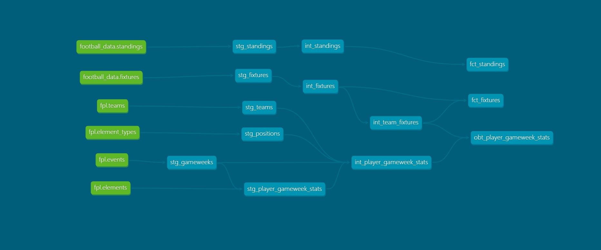

# FPL Analytics

## Overview

The aim of this project is to create an [app](https://robgriffin247--fpl-analytics-web-app-host-web-app.modal.run/) allowing the visualisation and exploration of data from Fantasy Premier League. That data includes player stats, team stats, fixtures and standings.

The project requires a back-end that automatically and routinely extracts, loads and transforms data from multiple APIs into a cloud-database. It also requires a front-end web app UI allowing interaction with the data and visualisations.

#### Data Stack


|Job|Tool|
|-----|-----|
|Version Control|Git & GitHub|
|Package Management|uv|
|CI/CD|GitHub Actions|
|Data Storage|MotherDuck (prod) & DuckDB (dev)|
|Extract & Load Data|httpx & dlt|
|Transform Data|dbt core|
|Orchestration|Modal|
|Web App|Modal & Streamlit|

#### Design

The FPL API includes statistics on players ("elements") and teams. The Football-Data API includes data on league standings and fixtures. This data is extracted from the APIs and loaded to a database on Motherduck using dlt. 

Data is then transformed using dbt to create datasets ready for use in the UI. Data models have been designed to persist data for each gameweek, retaining the latest load per gameweek for each player, to allow tracking of player performance over the season (obt_player_gameweek_stats contains one row per player and gameweek; the raw fpl_analytics.fpl.elements contains one row per player and dlt load). 



A Modal app with a cron schedule is used to run the two dlt pipelines and the dbt transformations every day. Data can be explored via the [motherduck web UI](https://app.motherduck.com/). When changes are committed to main, a Github workflow triggers a redeployment of the pipeline runner app if there have been any changes to files relating to the Modal pipeline runner app, dlt pipelines, dbt transformations or project dependencies.

Data is visualised in a Streamlit app (basic app is in place but further development to come), hosted with Modal and there is a Github workflow for deployment on changes to main.

## Run this project

- Prerequisites:
    - Motherduck account and [token](https://app.motherduck.com/settings/tokens)
    - Account and API key for [football-data.org](https://www.football-data.org/documentation/quickstart/)
    - Modal account

1.  Clone

    ```
    git clone git@github.com:robgriffin247/fpl_analytics
    cd fpl_analytics
    ```
    
1. Set up secrets/tokens
    1. Run ``cp .env_template .env``
    1. Add values for your secrets/tokens to the ``.env``
    1. Run ``direnv allow``
    1. Send into modal
        ```
        modal secret create fpl-analytics-secrets \
            MOTHERDUCK_TOKEN=$MOTHERDUCK_TOKEN \
            DESTINATION__DUCKDB__CREDENTIALS=md:fpl_analytics \
            FOOTBALL_DATA_API_KEY=$FOOTBALL_DATA_API_KEY
            DLT_DESTINATION=motherduck \
            DESTINATION__MOTHERDUCK__DATABASE=fpl_analytics \
            DBT_TARGET=prod
        ```

1. Install python and dependencies

    ```
    uv python install
    uv sync
    ```

1. Run/deploy the modal apps

    ```
    # Examples:
    # modal run or serve to test; run ignores cron schedule
    # modal deploy to update the deployed app
    # run specific functions with e.g. ...fpl_analytics_backend.py::dbt_only
    uv run modal run modal/fpl_analytics_backend.py
    ```

1. Run the streamlit app locally

    ```
    uv run streamlit run ui/app.py
    ```

*Note - if these instructions are missing something then let me know!*

## Tasks/Ideas

- [x] Setup version control with git 
- [x] Setup package management with uv
- [x] Load data from FPL using dlt
- [x] Load data from Football-Data.org using dlt
- [x] Transform data using dbt
- [x] Script to copy motherduck db to local
- [x] Create a modal cron job to run ELT process
- [x] Setup local and prod environments in dlt/dbt/modal
- [x] Github workflow to handle CD of backend
- [x] Create a streamlit UI with overview of player stats for the coming gameweek
- [x] Host UI on modal
- [x] Github workflow to handle CD of webapp
- [x] Trim fat in loaders 
- [ ] Add to UI
    - [ ] Trends for selected players
    - [ ] Standings and fixtures
    - [ ] Metrics widgets
- [ ] Automate linting?
- [ ] Slack/discord/email notice if ELT fails?
- [ ] Analytics: matomo?
- [ ] Modify the cron job to not run off-season
- [ ] User-facing bot:
    - Remind of team selection deadline
    - Show players newly unavailable
    - Highlight top performers, in-form players and good value players


## Maintenance

#### Bloating raw fpl data

Note that daily loads are unneccessary and will create some bloat in the fpl raw data as this uses ``write_disposition='append'``; there will be multiple loads per gameweek. The dbt transformations then use only the most recent per gameweek, so the excess can be removed periodically. Before removing the redundant rows:

1. Copy the motherduck db to the local machine using [copy_motherduck_to_local.py](https://github.com/robgriffin247/fpl_analytics/blob/main/helpers/copy_motherduck_to_local.py) 

1. Verify which rows will be **kept** in motherduck for each table using:
    ```
    select * 
    from fpl_analytics.fpl.<TABLE>
    where _dlt_load_id::double in (
        select _dlt_load_id from fpl_analytics.staging.stg_gameweeks
    );
    ```
1. Verify which rows will be **discarded** from motherduck using
    ```
    select * 
    from fpl_analytics.fpl.<TABLE>
    where _dlt_load_id::double not in (
        select _dlt_load_id from fpl_analytics.staging.stg_gameweeks
    );
    ```

1. Consider testing this on a local database first (not on the backup!)

1. Once certain, do this in motherduck

    ```
    del_SAFETY_ete * 
    from fpl_analytics.fpl.<TABLE>
    where _dlt_load_id::double not in (
        select _dlt_load_id from fpl_analytics.staging.stg_gameweeks
    );
    ```